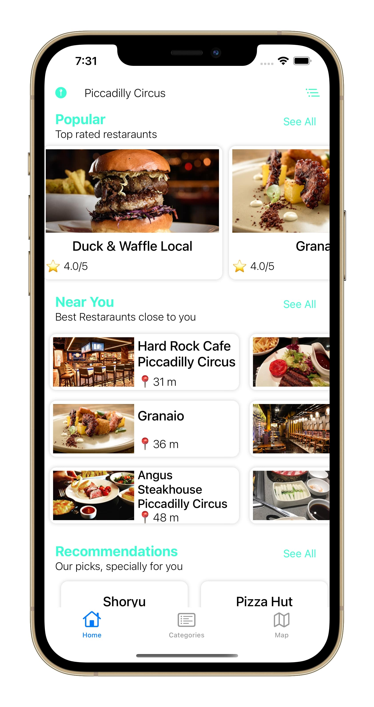
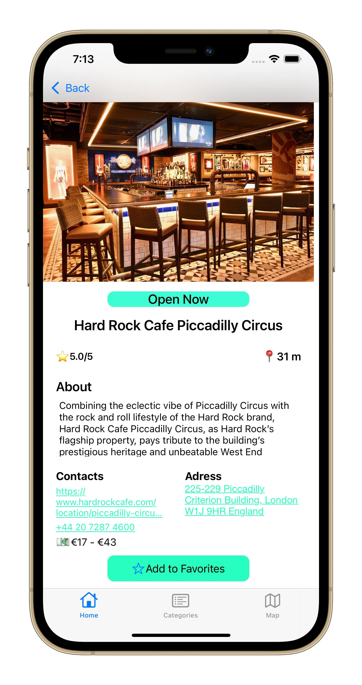
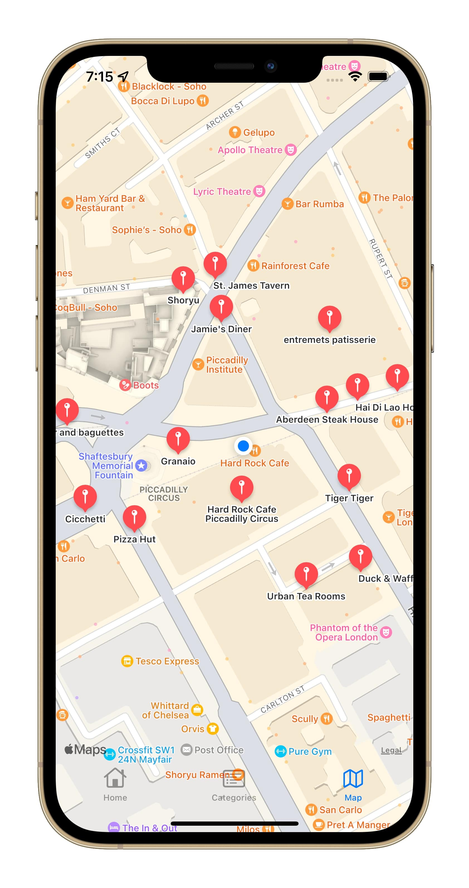
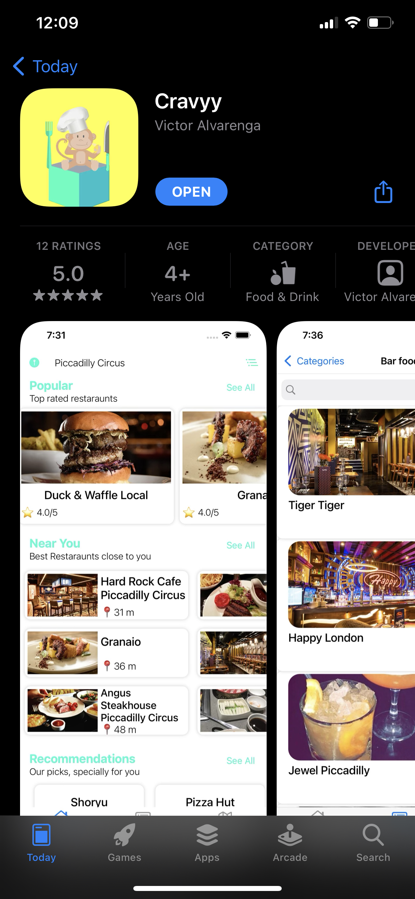

# Cravyy

   

# Description

Cravyy is an app Focused on bringing you the best restaurants and bars around your location, we aim to help our users to find where to eat, by simply choosing a category or trust in our picks.

GET INFORMATION ON THOUSANDS OF RESTAURANTS
We will always bring every information we can find on the Restaurant our user picks.

  
   
  

# Features
- Restaurants and Bars Recommendations
- Fetch Restaurants Nearby based on user's Preferences
- Add Restaurants to your Bookmarks so you can visit at a later date
- Pick a Food Category and get the best Restaurants around you with this cuisine

# Tools Used
### -  Swift  (Programming Language used on the entire Project)
### - MapKit  (Implement a map and add pins with restaurants around the user location)
### - CoreLocation(Get the user's location)
### - FireBase. (Implement Authentication in the app so users can sign up and login, and use FireBase FireStore Database)
### - CoreData. (Allow tge user to add Restaurants to the favorites section so it can be visited later)
### - CocoaPods. (ProgressHUD, KingFisher, IQKeyboardManager and FireBase)
### - Trip advisor API  (API used to fetch Restaurant and its details)
# Download
If you have an IOS device running ios 14.5 or later you can download this app at:https://apps.apple.com/pt/app/cravyy/id1589307279?l=en

   

